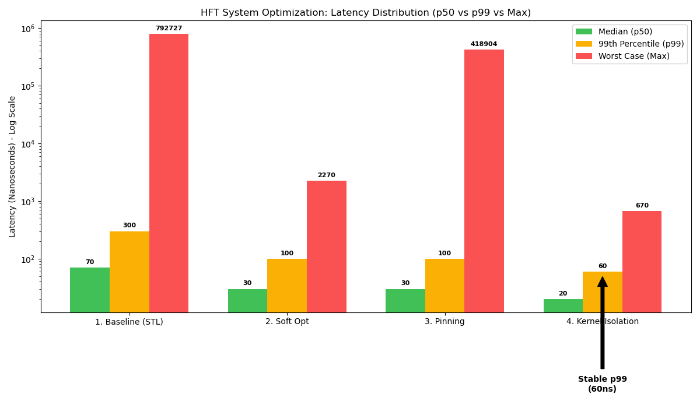

# Ultra-Low Latency Limit Order Book (C++20)


A high-performance, single-threaded Limit Order Book (LOB) engine designed for High-Frequency Trading (HFT) simulations.

This engine achieves **20 nanoseconds** median latency (approx. 74 CPU cycles) on standard hardware by eliminating dynamic memory allocations on the hot path, maximizing CPU cache locality, and utilizing Data-Oriented Design.

## Key Features

* **Deterministic Latency:** Zero `malloc`/`free` during trading operations via a custom `OrderPool`.
* **Data-Oriented Design:** `std::vector` based price levels for O(1) lookup and cache-friendly iteration (replacing standard `std::map` trees).
* **Intrusive Linked List:** Custom implementation to avoid memory indirection overhead and pointer chasing found in `std::list`.
* **Branch Prediction:** Extensive use of C++20 `[[likely]]`/`[[unlikely]]` attributes to optimize the CPU pipeline.
* **Cache Locality:** Memory layout designed to fit hot data within L1/L2 CPU caches.

## Software Benchmarks

**Environment:** AMD Ryzen 5 5600X @ 3.7 GHz | Rocky Linux 9.7 | GCC 11.5.0 `-O3`


> **Note:** The 99th percentile (p99) at 60ns proves that the engine is not only fast on average, but consistently fast for almost every order. 20ns is roughly equivalent to the latency of a single L2 Cache access. The engine logic effectively runs at the speed of memory access.

## Integration

This library is header-only (mostly) and designed to be included via CMake `FetchContent`.

```cmake
include(FetchContent)
FetchContent_Declare(
  lob_core
  GIT_REPOSITORY https://github.com/atribout/limit-order-book.git
  GIT_TAG        main
)
FetchContent_MakeAvailable(lob_core)
target_link_libraries(your_app PRIVATE lob_core)
```

## Architecture

- **Order Storage:** `OrderPool` (contiguous memory block, O(1) alloc/free).
- **Price Levels:** `std::vector<Level>` (direct indexing by price).
- **Matching Algo:** Price-Time Priority (FIFO).
- **Safety:** Comprehensive Unit Tests using Google Test to ensure matching logic correctness under load.

## Architecture

MIT License.
